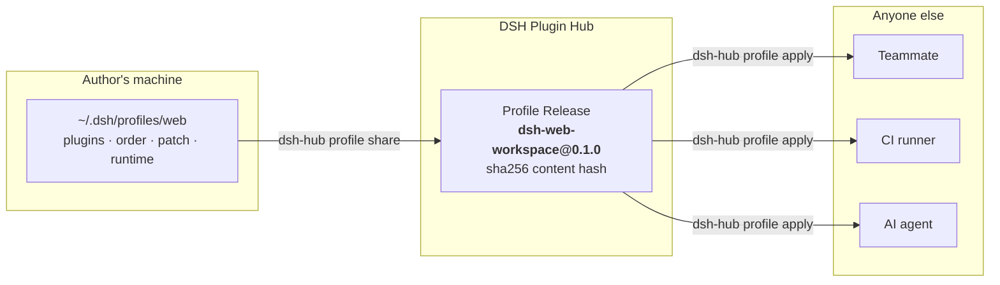
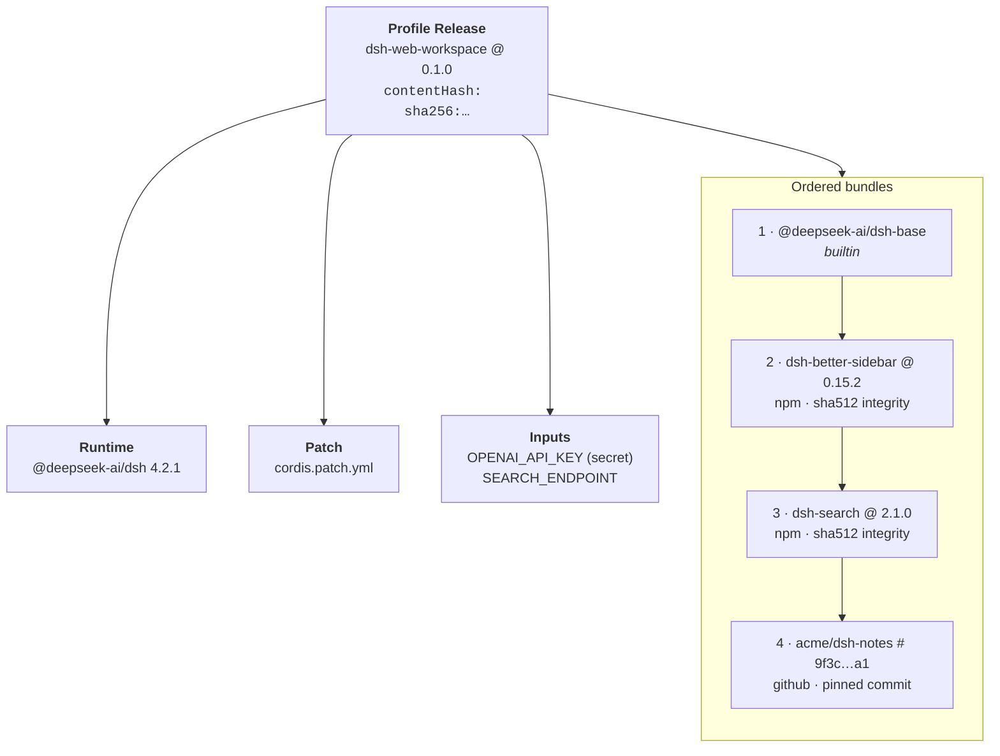
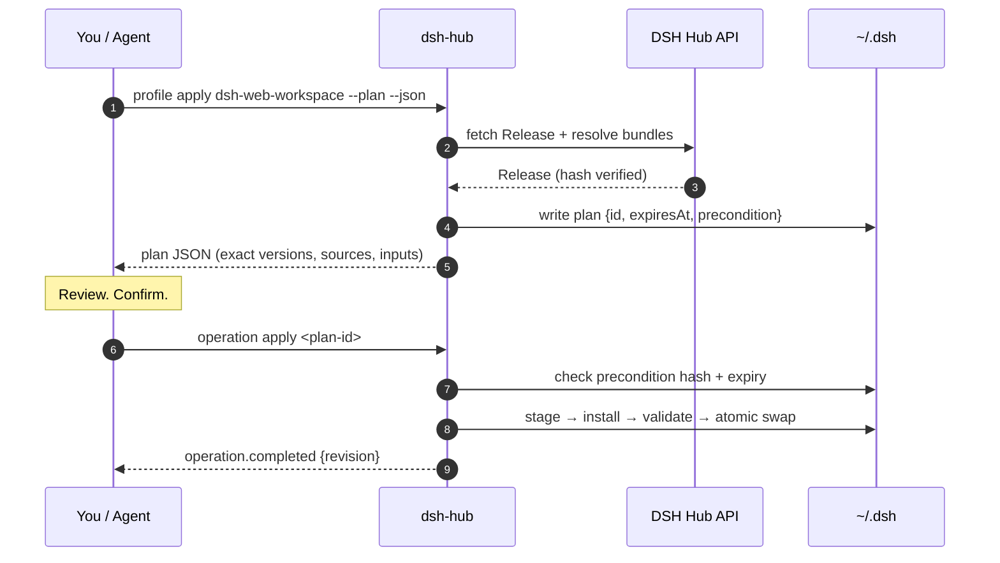
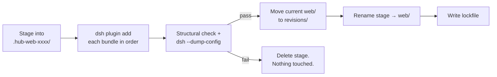
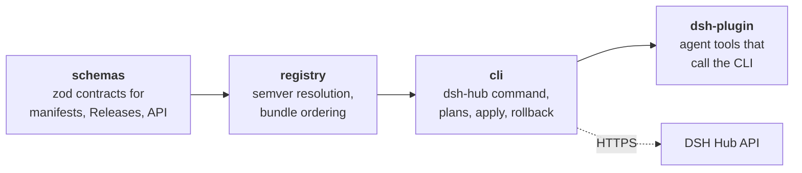

<div align="center">

<a href="https://dshpluginhub.ai"></a>

# DSH Hub CLI

**Share your entire DeepSeek Harness setup as one versioned, reproducible Profile.**

Capture the plugins, order, runtime, and config you have running locally. Publish it as an immutable Release. Anyone can apply it with a single command, review every change before it lands, and roll back if they don't like it.

### 🌐 [dshpluginhub.ai](https://dshpluginhub.ai) &nbsp;·&nbsp; [Browse Plugins](https://dshpluginhub.ai/plugins) &nbsp;·&nbsp; [Explore Profiles](https://dshpluginhub.ai/profiles) &nbsp;·&nbsp; [Docs](https://dshpluginhub.ai/docs)

[](https://www.npmjs.com/package/@dsh-plugin-hub/cli)
[](https://github.com/pax-beehive/dsh-hub-cli/actions/workflows/ci.yml)
[](https://nodejs.org)
[](LICENSE)

<a href="https://dshpluginhub.ai"></a>

<sub>This repository is the open-source client for the Hub. The website, API, and registry live at <a href="https://dshpluginhub.ai">dshpluginhub.ai</a>.</sub>

[Quick start](#quick-start) · [Why Profiles](#why-shareable-profiles) · [How it works](#how-it-works) · [Commands](#command-reference) · [Agent tools](#use-it-from-an-agent) · [Security](#security-and-privacy)

</div>

---

```bash
npm install --global @dsh-plugin-hub/cli

# Apply a teammate's Profile to your local "web" harness
dsh-hub profile apply dsh-web-workspace --version 0.1.0 --profile web
```

That one command installs the exact plugin versions, in the exact order, with the exact patch the author published. Not "whatever is latest today." What they had.

## Why shareable Profiles

A DeepSeek Harness (DSH) setup is more than a list of plugins. It is a specific runtime version, a set of plugins at specific versions, the order they load in, a `cordis.patch.yml` that wires them together, and a handful of environment variables that hold your keys.

Getting that onto a colleague's machine usually means a wiki page, a Slack thread, and an afternoon of "works on my machine."

**DSH Hub turns that setup into a first-class, versioned artifact.**



| Without DSH Hub | With a shared Profile |
| --- | --- |
| "Install these six plugins" | One slug and one version |
| Versions drift within days | Every version, source, and integrity hash is locked |
| Load order lives in someone's head | Order is part of the Release and validated on apply |
| Secrets get pasted into docs | Only `${ENV_VAR}` references are published; values stay local |
| Upgrades are a fresh install | `profile diff` shows exactly what changes before you upgrade |
| Broke it? Start over | `profile rollback` restores the previous complete revision |

<div align="center">
<a href="https://dshpluginhub.ai/profiles"></a>

<sub>Browse community Profiles, or build one in the web builder, at <a href="https://dshpluginhub.ai/profiles">dshpluginhub.ai/profiles</a>.</sub>
</div>

## What's inside a Profile Release

A Release is a small, content-addressed document. The CLI verifies its hash before doing anything with it.



- **Runtime** pins the exact DSH version the author verified against.
- **Bundles** are ordered. npm sources carry integrity hashes. GitHub sources must point at a full 40-character commit, never a branch.
- **Patch** is the author's `cordis.patch.yml`, published verbatim.
- **Inputs** declare which environment variables the Profile needs. The CLI refuses to publish a patch that contains a credential-looking value.

## Quick start

Requires **Node.js 22.13+** and **pnpm** on your `PATH`.

```bash
npm install --global @dsh-plugin-hub/cli
dsh-hub --help
```

### Apply someone's Profile

```bash
# Find one
dsh-hub profile search workspace

# See exactly what would change on your machine
dsh-hub profile diff dsh-web-workspace --version 0.1.0 --profile web

# Apply it (staged, validated, then swapped in atomically)
dsh-hub profile apply dsh-web-workspace --version 0.1.0 --profile web

# Confirm everything is healthy
dsh-hub profile doctor --profile web
```

### Share your own

```bash
# Preview what would be captured from ~/.dsh/profiles/web
dsh-hub profile share my-stack --version 1.0.0 --profile web --dry-run

# Sign in once, then publish an immutable Release
dsh-hub login
dsh-hub profile share my-stack --version 1.0.0 --profile web
```

### Upgrade and roll back

```bash
dsh-hub profile upgrade --version 0.2.0 --profile web --dry-run   # review the diff
dsh-hub profile upgrade --version 0.2.0 --profile web             # apply it
dsh-hub profile history --profile web                             # see saved revisions
dsh-hub profile rollback --profile web                            # restore the previous one
```

### Install a single plugin

```bash
dsh-hub search memory
dsh-hub info dsh-context --version 1.2.3
dsh-hub install dsh-context --version 1.2.3 --profile web
```

## How it works

### Every mutation is a reviewable plan

Nothing that changes your local harness runs immediately. The CLI first writes a **plan**: an exact, expiring description of what will happen, plus a fingerprint of the current state. You apply the plan by ID. If the local Profile changed in between, or 30 minutes passed, the plan is rejected and you make a fresh one.



This is what makes the CLI safe to hand to an AI agent. The agent can plan freely, but a human confirms the exact plan ID before anything moves.

### Apply is staged, validated, and atomic



The previous Profile directory and its lockfile are kept as a complete revision. Rollback is a rename, not a reinstall.

### Packages



| Package | What it owns |
| --- | --- |
| [`@dsh-plugin-hub/schemas`](packages/schemas) | Runtime-validated Plugin, Profile, and Hub API contracts |
| [`@dsh-plugin-hub/registry`](packages/registry) | Deterministic version resolution and Profile bundle ordering |
| [`@dsh-plugin-hub/cli`](packages/cli) | The `dsh-hub` command: search, plans, apply, diff, doctor, share, rollback |
| [`@dsh-plugin-hub/dsh-plugin`](packages/dsh-plugin) | DSH agent tools backed by the same plan/apply pipeline |

All four ship in lockstep under one version. See [docs/architecture.md](docs/architecture.md) for trust boundaries.

## Command reference

| Command | What it does |
| --- | --- |
| `dsh-hub search <query>` | Search the Plugin catalog |
| `dsh-hub info <package> [--version]` | Show a plugin's resolved version, source, compatibility, and security assessment |
| `dsh-hub install <package> [--version] [--profile]` | Install one plugin into a local Profile |
| `dsh-hub profile search <query>` | Search published Profiles |
| `dsh-hub profile apply <slug> [--version] [--profile]` | Apply a Profile Release |
| `dsh-hub profile upgrade [slug] [--version] [--profile]` | Upgrade the installed Profile to another Release |
| `dsh-hub profile diff [slug] [--version] [--profile]` | Compare local state with a Release |
| `dsh-hub profile doctor [slug] [--profile]` | Check directory, lockfile, order, installed versions, required inputs, and drift |
| `dsh-hub profile share <slug> --version <v> [--profile]` | Publish the local Profile as an immutable Release |
| `dsh-hub profile capture <slug> [--profile]` | Print the captured Profile draft without publishing |
| `dsh-hub profile import <file.dshprofile> [--profile]` | Apply a Release from an exported archive |
| `dsh-hub profile history [--profile]` | List recoverable local revisions |
| `dsh-hub profile rollback [revision] [--profile]` | Restore a previous revision |
| `dsh-hub operation apply <plan-id>` | Execute a previously created plan |
| `dsh-hub init [dir] --repository <owner/repo>` | Scaffold a new plugin package |
| `dsh-hub validate [dir]` | Validate a plugin or Profile package directory |
| `dsh-hub login` / `logout` | Sign in to the Hub with a device code |
| `dsh-hub telemetry state\|on\|off` | Manage anonymous usage reporting |

Common flags: `--profile <name>` (default `web`), `--version <exact|tag|range>`, `--dry-run`, `--plan`, `--json`, `--no-telemetry`, `--api <url>`.

## Use it from an agent

Install the adapter into a Profile and your DSH agent gets eleven tools that map one-to-one onto the CLI:

```bash
dsh plugin --profile web add @dsh-plugin-hub/dsh-plugin
```

Read-only tools (`dsh_hub_search`, `dsh_hub_profile_diff`, `dsh_hub_profile_doctor`, …) run freely. Mutating tools only ever *create plans*. A single `dsh_hub_operation_apply` tool executes a plan, and it requires `confirmed: true`, which the agent may only set after the user approves that exact plan.

The repository also ships a reviewable [`dsh-hub` agent Skill](skills/dsh-hub/SKILL.md) that spells out the confirm-before-apply rules for any agent driving the CLI.

## Security and privacy

The CLI installs packages, edits local DSH Profiles, and stores a Hub login session. It is built to make each of those inspectable and reversible:

- **Content-addressed Releases.** A Release carries a `sha256` hash. The CLI recomputes it and refuses mismatches.
- **Pinned sources.** npm bundles carry integrity hashes. GitHub bundles must reference a full commit.
- **Explicit plans.** Mutations expire after 30 minutes and fail if the local state changed since planning.
- **Staged apply.** Validation happens in a staging directory. Your live Profile is swapped only after it passes.
- **Recoverable revisions.** The previous Profile and lockfile are kept intact for rollback.
- **Secrets stay local.** `profile share` refuses patches containing credential-looking values and publishes only environment-variable references.
- **Session storage.** Tokens live in `~/.dsh/.hub/auth.json` with mode `0600`. The embedded WorkOS client ID is a public OAuth identifier.

**Telemetry.** After a first-run notice, lifecycle commands send anonymous, aggregate-only usage events (slug, version, outcome, error category, duration, platform, CLI version). No account, machine ID, path, config, or environment value is ever included. Disable it with `dsh-hub telemetry off`, `--no-telemetry`, `DSH_HUB_TELEMETRY=0`, or `DO_NOT_TRACK=1`. Full field list and retention policy: [packages/cli/README.md](packages/cli/README.md#anonymous-cli-telemetry).

To report a vulnerability, follow [SECURITY.md](SECURITY.md).

## Development

```bash
corepack enable
pnpm install --frozen-lockfile
pnpm check        # typecheck + tests + package-content audit
```

```
packages/
  schemas/       zod contracts
  registry/      resolver + bundle ordering
  cli/           the dsh-hub command
  dsh-plugin/    agent tool adapter
skills/dsh-hub/  agent Skill
docs/            architecture, releasing
```

Tests use Node's built-in runner. After `pnpm build`, run a single package's suite with:

```bash
node --test packages/cli/tests/*.test.ts
```

Release notes live in [CHANGELOG.md](CHANGELOG.md) and the release process in [docs/releasing.md](docs/releasing.md).

## Contributing

Bug reports and pull requests are welcome. Start with [CONTRIBUTING.md](CONTRIBUTING.md). By participating you agree to the [Code of Conduct](CODE_OF_CONDUCT.md).

## License

[MIT](LICENSE)

<sub>DSH Hub is an independent community project and is not affiliated with or endorsed by DeepSeek.</sub>
