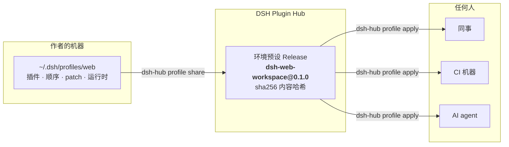
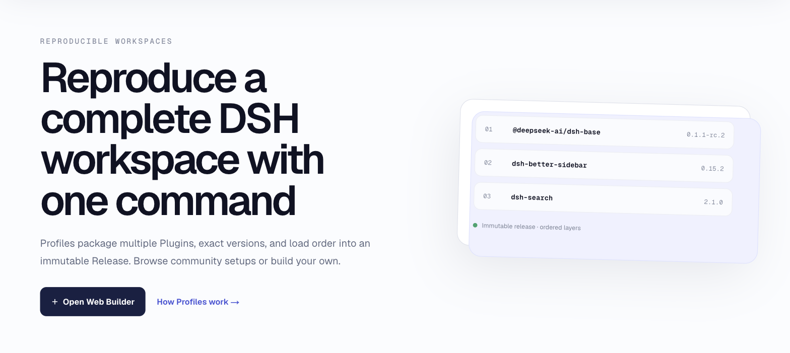
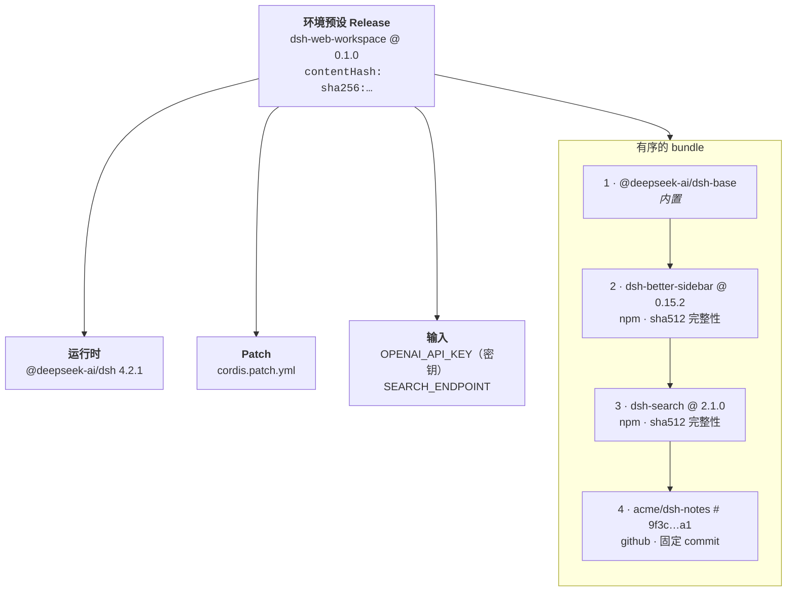
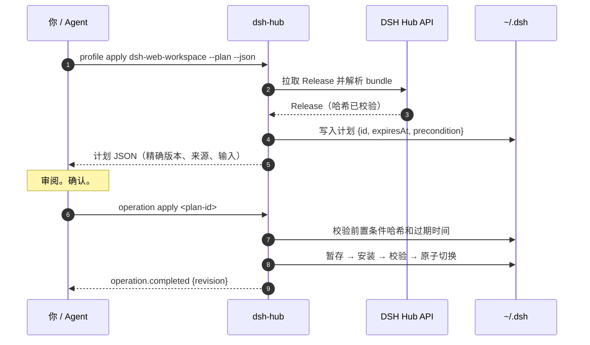
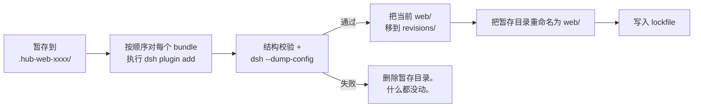
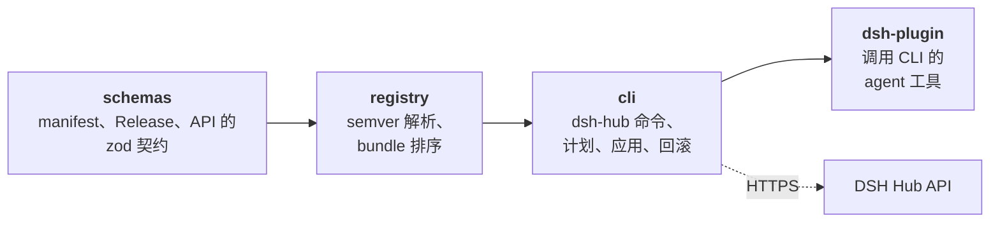

<div align="center">

<a href="https://dshpluginhub.ai"></a>

# DSH Hub CLI

[English](README.md) · **简体中文**

**把你的整套 DeepSeek Harness 配置打包成一个带版本、可复现的环境预设，分享给任何人。**

捕获本地正在运行的插件、加载顺序、运行时和配置，发布为一个不可变的 Release。其他人一条命令即可应用，落地前可以审阅每一处变更，不满意随时回滚。

### 🌐 [dshpluginhub.ai](https://dshpluginhub.ai) &nbsp;·&nbsp; [浏览插件](https://dshpluginhub.ai/plugins) &nbsp;·&nbsp; [探索环境预设](https://dshpluginhub.ai/profiles) &nbsp;·&nbsp; [文档](https://dshpluginhub.ai/docs)

[](https://www.npmjs.com/package/@dsh-plugin-hub/cli)
[](https://github.com/pax-beehive/dsh-hub-cli/actions/workflows/ci.yml)
[](https://nodejs.org)
[](LICENSE)

<a href="https://dshpluginhub.ai"></a>

<sub>本仓库是 Hub 的开源客户端。网站、API 和注册表位于 <a href="https://dshpluginhub.ai">dshpluginhub.ai</a>。</sub>

[快速开始](#快速开始) · [为什么需要可分享的环境预设](#为什么需要可分享的环境预设) · [命令一览](#命令一览) · [支持](SUPPORT.zh-CN.md) · [参与贡献](CONTRIBUTING.zh-CN.md) · [治理](GOVERNANCE.zh-CN.md) · [安全](SECURITY.zh-CN.md)

</div>

---

```bash
npm install --global @dsh-plugin-hub/cli

# 把同事的环境预设应用到本地名为 "web" 的 harness
dsh-hub profile apply dsh-web-workspace --version 0.1.0 --profile web
```

这一条命令会按作者发布时的精确版本、精确顺序和精确 patch 安装插件。不是"今天的 latest 是什么就装什么"，而是作者当时拥有的那一套。

## 为什么需要可分享的环境预设

一套 DeepSeek Harness（DSH）配置远不止一份插件清单。它包括特定的运行时版本、一组特定版本的插件、它们的加载顺序、把它们串起来的 `cordis.patch.yml`，以及几个存放密钥的环境变量。

把这套东西搬到同事的机器上，通常意味着一页 wiki、一串 Slack 消息，和一下午的"在我机器上是好的"。

**DSH Hub 把这套配置变成了一等公民：一个带版本的制品。**



| 没有 DSH Hub | 有了共享环境预设 |
| --- | --- |
| "把这六个插件装一下" | 一个 slug 加一个版本号 |
| 几天之内版本就漂移 | 每个版本、来源和完整性哈希都被锁定 |
| 加载顺序只存在于某人脑子里 | 顺序是 Release 的一部分，应用时会校验 |
| 密钥被粘贴进文档 | 只发布 `${ENV_VAR}` 引用，真实值留在本地 |
| 升级等于重装 | `profile diff` 在升级前精确展示会改动什么 |
| 弄坏了？从头再来 | `profile rollback` 恢复上一个完整版本 |

<div align="center">
<a href="https://dshpluginhub.ai/profiles"></a>

<sub>在 <a href="https://dshpluginhub.ai/profiles">dshpluginhub.ai/profiles</a> 浏览社区环境预设，或用网页构建器创建你自己的。</sub>
</div>

## 环境预设 Release 里有什么

Release 是一份很小的、按内容寻址的文档。CLI 在对它做任何操作之前都会先校验哈希。



- **运行时**固定为作者验证过的那个精确 DSH 版本。
- **Bundle** 是有序的。npm 来源带完整性哈希；GitHub 来源必须指向完整的 40 位 commit，不允许是分支。
- **Patch** 是作者的 `cordis.patch.yml`，原样发布。
- **输入**声明这个环境预设需要哪些环境变量。如果 patch 里包含看起来像凭据的值，CLI 会拒绝发布。

## 快速开始

需要 **Node.js 22.13+**，并且 **pnpm** 在 `PATH` 上。

```bash
npm install --global @dsh-plugin-hub/cli
dsh-hub --help
```

### 应用别人的环境预设

```bash
# 找一个
dsh-hub profile search workspace

# 精确查看你机器上会发生什么变化
dsh-hub profile diff dsh-web-workspace --version 0.1.0 --profile web

# 应用它（先暂存、校验，再原子切换）
dsh-hub profile apply dsh-web-workspace --version 0.1.0 --profile web

# 确认一切正常
dsh-hub profile doctor --profile web
```

### 分享你自己的

```bash
# 预览会从 ~/.dsh/profiles/web 捕获到什么
dsh-hub profile share my-stack --version 1.0.0 --profile web --dry-run

# 登录一次，然后发布为不可变的 Release
dsh-hub login
dsh-hub profile share my-stack --version 1.0.0 --profile web

# CI：用发布专用令牌代替交互式登录
DSH_HUB_TOKEN=dshhub_... dsh-hub profile share my-stack --version 1.0.0 --profile web
```

### 升级与回滚

```bash
dsh-hub profile upgrade --version 0.2.0 --profile web --dry-run   # 审阅 diff
dsh-hub profile upgrade --version 0.2.0 --profile web             # 应用
dsh-hub profile history --profile web                             # 查看已保存的版本
dsh-hub profile rollback --profile web                            # 恢复上一个
```

### 安装单个插件

```bash
dsh-hub search memory
dsh-hub info dsh-context --version 1.2.3
dsh-hub install dsh-context --version 1.2.3 --profile web
```

## 工作原理

### 每一次变更都是可审阅的计划

任何会改动本地 harness 的操作都不会立即执行。CLI 先写一份**计划**：精确描述将要发生什么，带过期时间，并附上当前状态的指纹。你按 ID 应用这份计划。如果这期间本地 Profile 发生了变化，或者已经过了 30 分钟，计划会被拒绝，需要重新生成。



正是这一点让 CLI 可以放心交给 AI agent 使用。Agent 可以随意生成计划，但在任何东西被改动之前，必须由人确认那个精确的计划 ID。

### 应用过程是暂存、校验、原子切换



上一个 Profile 目录和它的 lockfile 会作为完整版本保留下来。回滚只是一次重命名，不是重装。

### 包结构



| 包 | 职责 |
| --- | --- |
| [`@dsh-plugin-hub/schemas`](packages/schemas) | 运行时校验的插件、环境预设和 Hub API 契约 |
| [`@dsh-plugin-hub/registry`](packages/registry) | 确定性的版本解析和环境预设 bundle 排序 |
| [`@dsh-plugin-hub/cli`](packages/cli) | `dsh-hub` 命令：搜索、计划、应用、diff、doctor、分享、回滚 |
| [`@dsh-plugin-hub/dsh-plugin`](packages/dsh-plugin) | 基于同一套计划/应用流水线的 DSH agent 工具 |

四个包以同一版本号同步发布。信任边界见 [docs/architecture.md](docs/architecture.md)。

## 命令一览

| 命令 | 作用 |
| --- | --- |
| `dsh-hub search <query>` | 搜索插件目录 |
| `dsh-hub info <package> [--version]` | 查看插件解析后的版本、来源、兼容性和安全评估 |
| `dsh-hub sync <package>` | 立即同步一个 npm 包，让刚发布的插件或环境预设版本不必等定时任务 |
| `dsh-hub install <package> [--version] [--profile]` | 把单个插件安装到本地 Profile |
| `dsh-hub profile search <query>` | 搜索已发布的环境预设 |
| `dsh-hub profile apply <slug> [--version] [--profile]` | 应用一个环境预设 Release |
| `dsh-hub profile upgrade [slug] [--version] [--profile]` | 把已安装的环境预设升级到另一个 Release |
| `dsh-hub profile diff [slug] [--version] [--profile]` | 对比本地状态和某个 Release |
| `dsh-hub profile doctor [slug] [--profile]` | 检查目录、lockfile、顺序、已安装版本、必需输入和漂移 |
| `dsh-hub profile share <slug> --version <v> [--profile]` | 把本地 Profile 发布为不可变的 Release |
| `dsh-hub profile capture <slug> [--profile]` | 打印捕获到的环境预设草稿，不发布 |
| `dsh-hub profile import <file.dshprofile> [--profile]` | 从导出的归档文件应用 Release |
| `dsh-hub profile history [--profile]` | 列出可恢复的本地版本 |
| `dsh-hub profile rollback [revision] [--profile]` | 恢复到之前的某个版本 |
| `dsh-hub operation apply <plan-id>` | 执行之前生成的计划 |
| `dsh-hub init [dir] --repository <owner/repo>` | 生成一个新插件包的骨架 |
| `dsh-hub validate [dir]` | 校验一个插件或环境预设包目录 |
| `dsh-hub login` / `logout` | 通过设备码登录 Hub |
| `dsh-hub telemetry state\|on\|off` | 管理匿名使用统计 |

常用参数：`--profile <name>`（默认 `web`）、`--version <精确版本|tag|范围>`、`--dry-run`、`--plan`、`--json`、`--no-telemetry`、`--api <url>`。

## 在 Agent 中使用

把适配器装进某个 Profile，你的 DSH agent 就获得了 11 个与 CLI 一一对应的工具：

```bash
dsh plugin --profile web add @dsh-plugin-hub/dsh-plugin
```

只读工具（`dsh_hub_search`、`dsh_hub_profile_diff`、`dsh_hub_profile_doctor` 等）可以自由调用。会产生变更的工具永远只*生成计划*。只有一个 `dsh_hub_operation_apply` 工具会真正执行计划，而且它要求 `confirmed: true`，agent 只有在用户批准了那个精确的计划之后才能设置这个值。

仓库还附带一份可审阅的 [`dsh-hub` agent Skill](skills/dsh-hub/SKILL.md)，为任何驱动这个 CLI 的 agent 写明了"先确认再应用"的规则。

## 安全与隐私

CLI 会安装软件包、修改本地 DSH Profile，并保存 Hub 登录会话。它的设计目标是让这三件事都可检查、可撤销：

- **按内容寻址的 Release。** 每个 Release 带一个 `sha256` 哈希。CLI 会重新计算并拒绝不匹配的。
- **固定来源。** npm bundle 带完整性哈希。GitHub bundle 必须引用完整的 commit。
- **显式计划。** 变更操作 30 分钟后过期；如果本地状态在计划生成后发生了变化，则执行失败。
- **暂存应用。** 校验在暂存目录中进行。只有通过之后才会切换你正在使用的 Profile。
- **可恢复的版本。** 上一个 Profile 和 lockfile 会完整保留，供回滚使用。
- **密钥留在本地。** `profile share` 会拒绝包含疑似凭据的 patch，只发布环境变量引用。
- **会话存储。** Token 保存在 `~/.dsh/.hub/auth.json`，权限为 `0600`。内嵌的 WorkOS client ID 是公开的 OAuth 标识符。

**遥测。** 首次运行会显示一条通知，之后生命周期命令会发送匿名的、仅聚合的使用事件（slug、版本、结果、错误类别、耗时、平台、CLI 版本）。绝不包含账号、机器 ID、路径、配置或环境变量的值。可用 `dsh-hub telemetry off`、`--no-telemetry`、`DSH_HUB_TELEMETRY=0` 或 `DO_NOT_TRACK=1` 关闭。完整字段列表和保留策略见 [packages/cli/README.md](packages/cli/README.md#anonymous-cli-telemetry)。

报告安全漏洞请按 [SECURITY.md](SECURITY.md) 的流程操作。

## 开发

```bash
corepack enable
pnpm install --frozen-lockfile
pnpm check        # 类型检查 + 测试 + 打包内容审计
```

```
packages/
  schemas/       zod 契约
  registry/      解析器 + bundle 排序
  cli/           dsh-hub 命令
  dsh-plugin/    agent 工具适配器
skills/dsh-hub/  agent Skill
docs/            架构、发布流程
```

测试使用 Node 内置的测试运行器。先 `pnpm build`，然后可以单独跑某个包的测试：

```bash
node --test packages/cli/tests/*.test.ts
```

版本更新记录见 [CHANGELOG.md](CHANGELOG.md)，发布流程见 [docs/releasing.md](docs/releasing.md)。

## 参与贡献

欢迎提交 bug 报告和 pull request。请先阅读 [CONTRIBUTING.md](CONTRIBUTING.md)。参与本项目即表示你同意遵守[行为准则](CODE_OF_CONDUCT.md)。

## 许可证

[MIT](LICENSE)

<sub>DSH Hub 是一个独立的社区项目，与 DeepSeek 无关，也未获得其背书。</sub>
